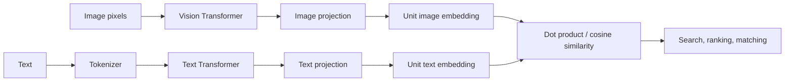

# Build Your Own Multi-Modal Projector (CLIP)

This repository is both a working multimodal embedding service and a guided implementation of the ideas behind CLIP (Contrastive Language–Image Pre-training). Its goal is not merely to expose an endpoint: it explains how a machine can place an image and a sentence in the same mathematical space, how that model is trained, and how to operate it responsibly.

## What you will learn

By reading the guides and following the code, you will understand:

1. Why computers need an embedding rather than a raw image or sentence to perform semantic search.
2. How contrastive learning makes matching image/text pairs close together and non-matching pairs far apart.
3. How a Vision Transformer turns image patches into an image representation.
4. How a text Transformer turns token IDs into a sentence representation.
5. Why L2 normalization plus dot product is cosine similarity, and why that matters.
6. How the symmetric CLIP loss trains both encoders at once.
7. What data, evaluation, checkpointing, and promotion are required before a model is useful.
8. How an inference API validates hostile input, loads a model, measures latency, and scales safely.
9. Why an inference service generally should not store user images or embeddings.
10. Which parts of this educational implementation differ from a large, production-trained CLIP model.

## Read in this order

| Guide | Purpose |
|---|---|
| [Concepts: from pixels and words to embeddings](docs/concepts.md) | Starts from first principles and derives the contrastive objective. |
| [Architecture and code tour](docs/architecture.md) | Maps every model and service concept to a module in this repository. |
| [Training, data, and evaluation](docs/training.md) | Explains how to build and validate an actual checkpoint. |
| [Serving and API guide](docs/serving.md) | Explains requests, preprocessing, responses, deployment boundaries, and failure behavior. |
| [Security guide](docs/security.md) | Threat model, OWASP controls, privacy, and safe model artifacts. |
| [Operations guide](docs/operations.md) | Releases, observability, SLOs, incidents, rollback, and recovery. |
| [OpenAPI contract](docs/openapi.yaml) | Machine-readable endpoint specification. |

## The project in one picture



At training time, a mini-batch contains pairs such as `(photo of a dog, "a dog running")`. The loss raises the score for each correct pair and lowers scores for every other cross-pair in the batch. At serving time, no training occurs: the model encodes a supplied image/text and returns vectors or a score.

## Important expectation

The code implements the mechanism of CLIP; it does **not** ship an already knowledgeable model. A newly created model has random weights, so its outputs are structurally valid but semantically meaningless. Train it on a lawful, curated image-caption corpus and promote only an evaluated checkpoint. The custom tokenizer is intentionally simple and its exact implementation is part of the checkpoint contract.

## Run locally

Requires Python 3.11 or newer.

```bash
python3.11 -m venv .venv
. .venv/bin/activate
pip install -e '.[dev]'
cp .env.example .env
clip-projector
```

Then call the API:

```bash
curl -X POST http://localhost:8080/v1/embeddings/text \
  -H 'X-API-Key: replace-with-at-least-32-random-characters' \
  -H 'Content-Type: application/json' \
  -d '{"texts":["a photograph of a bicycle"]}'
```

The interactive contract is at `http://localhost:8080/docs`. Run engineering checks with `ruff check .`, `mypy clip_projector`, `bandit -qr clip_projector`, and `pytest`. See the training and serving guides before treating the local process as a production deployment.
