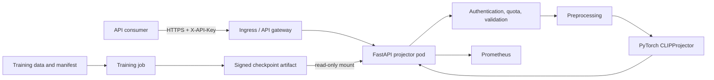
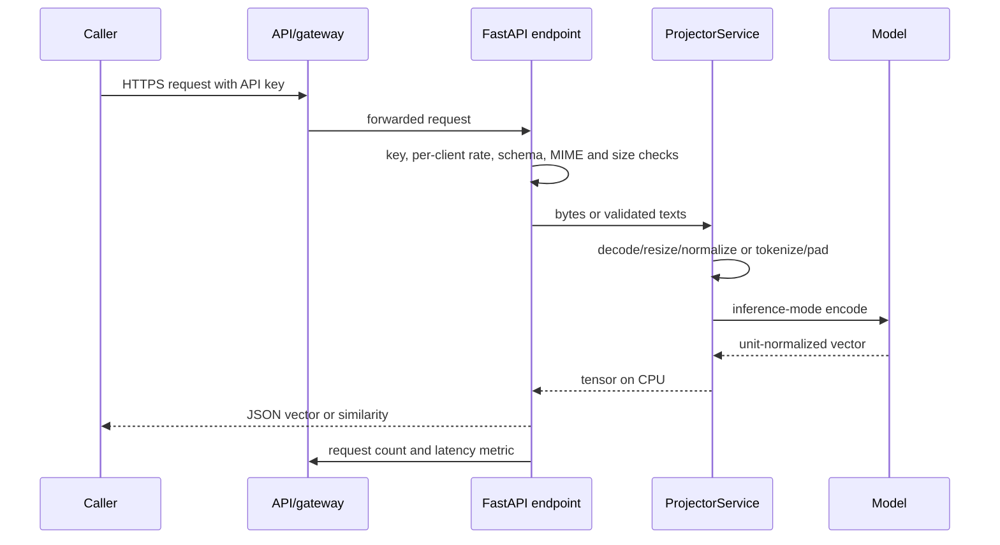

# Architecture and code tour

## System boundaries

There are two deliberately separate systems. The **training system** turns curated pairs into a checkpoint. The **online inference system** loads one immutable checkpoint and answers requests. Training needs heavy compute, experiments, data governance, and a model registry. Serving needs predictable latency, isolation from untrusted input, availability, and observability. Mixing them in one request process would make the public API slow, non-reproducible, and risky.

This repository only persists artifacts outside the request path: JSONL manifests and model checkpoints. It has no relational database because an embedding request should not silently retain a user’s image, prompt, or vector. A product that needs search should add an asynchronous indexing consumer and a separately designed vector store with tenant isolation, deletion, retention, and re-embedding workflows.

## Module-by-module map

| File | Responsibility | Why it is separate |
|---|---|---|
| `model.py` | ViT, text Transformer, projections, logits, contrastive loss | Pure ML computation is testable without HTTP. |
| `preprocessing.py` | Safe image decoding/normalization and tokenization | Prevents serving/training preprocessing drift. |
| `train.py` | JSONL dataset, loader, AdamW optimization, checkpoint save | Keeps batch/offline code out of the API process. |
| `service.py` | Model lifecycle and inference-mode calls | One small adapter owns device placement and checkpoint loading. |
| `main.py` | Routes, HTTP errors, metrics, CORS, logging | Transport policy does not leak into model code. |
| `security.py` | API-key comparison and bounded in-memory rate limiter | Security behavior is explicit and independently testable. |
| `config.py` | Environment validation and parsed settings | Deployment configuration is not hard-coded. |

## Request lifecycle, step by step

The endpoint reads at most `max_upload_bytes + 1`, then rejects excessive input. It checks declared MIME type before decoder work, but the decoder is still authoritative: a file labelled PNG that cannot be decoded returns 422. MIME alone is not a security guarantee; it merely limits accepted formats. The service keeps input bytes in memory for the duration of the request and does not log them.

For text, Pydantic checks batch cardinality and string length. Tokenization lower-cases and collapses whitespace, rejects blank text, hashes pieces into vocabulary IDs, pads to context length, and masks padding. For images, Pillow decodes, RGB-converts, resizes and normalizes. The model uses `torch.inference_mode()` to prevent gradient allocation, and results are moved to CPU before JSON conversion.

## Model internals and tensor shapes

With default configuration and batch size `B`:

| Stage | Image branch | Text branch |
|---|---|---|
| Input | `[B, 3, 224, 224]` | `[B, 77]` integer IDs |
| Tokens | `[B, 197, 256]` (196 patches + CLS) | `[B, 77, 256]` |
| Encoder output | `[B, 256]` CLS state | `[B, 256]` final non-padding state |
| Projection and normalization | `[B, 256]` | `[B, 256]` |
| Training score matrix | `image_features @ text_features.T` is `[B, B]` | transpose for text-to-image |

The default dimensions are intentionally modest so the design can be read and tested on CPU. Capacity is a trade-off: a wider/deeper network can express more patterns but costs memory, training data, inference time, and carbon. Any architecture change creates a new checkpoint family; never try to load weights across incompatible shapes.

## Design decisions and trade-offs

| Decision | Benefit | Cost / mitigation |
|---|---|---|
| In-process PyTorch | Lowest serving complexity and no serialization hop | Each replica holds a model; use HPA/GPU nodes and immutable rollout for scale. |
| Stateless request handling | Privacy and simple horizontal scaling | Search/history features require a separate governed system. |
| Checkpoint at process start | Every request uses one known version | Changes require rollout; this is intentional for reproducibility. |
| API key plus gateway | Simple service authentication | Use OIDC/mTLS and centralized per-tenant policy for larger organizations. |
| Per-pod sliding window | Local abuse protection without external dependency | It is not global; enforce authoritative global quotas at gateway. |
| Hash tokenizer | Easy to inspect/reproduce | Collisions and weak linguistic handling; replace with versioned BPE before serious training. |

## Artifact and configuration versioning

A deployable model release should identify: Git commit; model config; tokenizer/preprocessing version; dataset manifest digest; training command and random seed; package/container digest; checkpoint SHA-256; evaluation report; and approver. Store metadata next to—not inside only—the checkpoint, in immutable artifact storage. On startup, verify that expected config and checkpoint digest match the deployment record. A rollback selects a prior complete release tuple, not merely “an old weights file.”

The next stage is [training](training.md); after that, see [serving](serving.md) for how this architecture becomes an API.
