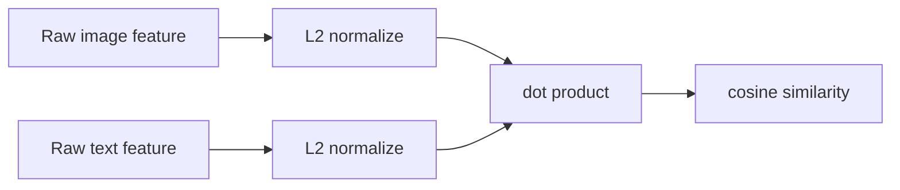
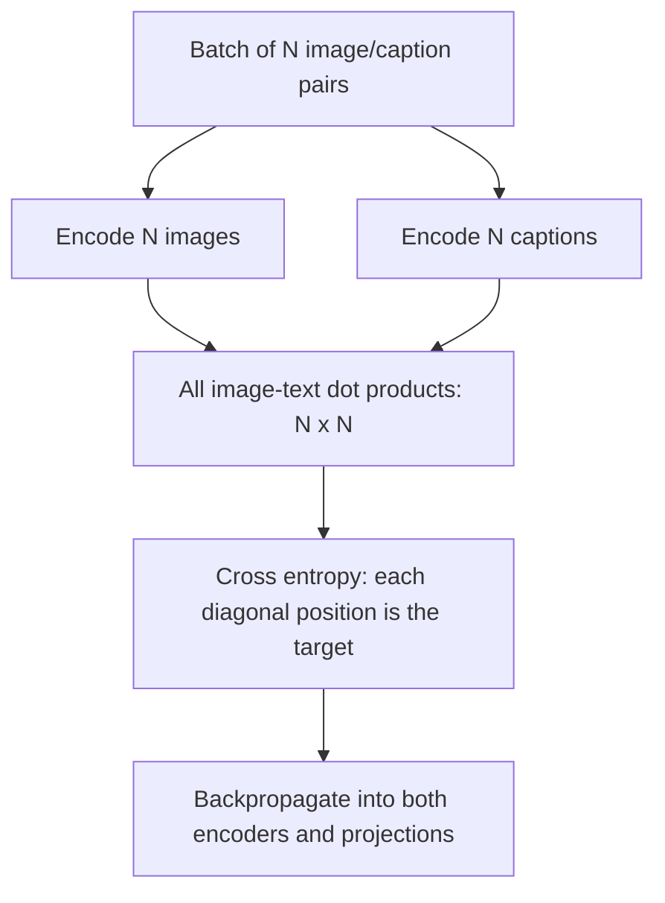

# Concepts: building a multimodal projector from scratch

## 1. The problem

An image is a grid of numbers. A 224×224 RGB image contains 150,528 colour values. A sentence is a sequence of characters. Neither representation tells a program directly that the image of a golden retriever and the phrase “a friendly dog” are related. A multimodal projector learns a function that maps both inputs into one shared vector space:

`image -> f(image) = i in R^d`

`text -> g(text) = t in R^d`

The word *projector* means the final learned mapping into that shared `d`-dimensional space. If training succeeds, semantically compatible vectors point in similar directions. We can then retrieve images with text, retrieve text with images, rank captions, or classify an image against a list of natural-language labels without training a separate classifier.

An embedding is not an explanation, database key, or probability. It is a compact list of floating-point numbers whose geometry has been learned from data. Its usefulness depends on data coverage, labels/captions, model capacity, and evaluation—not on the fact that it has a fixed length.

## 2. Similarity and normalization

For two vectors `a` and `b`, the dot product is `a · b = sum(a_j * b_j)`. Large values indicate aligned directions, but also grow when either vector has a large magnitude. CLIP removes magnitude by L2-normalizing each vector:

`a_hat = a / sqrt(sum(a_j^2))`

After normalization, `a_hat · b_hat` is cosine similarity: a value from -1 to 1. A value near 1 means vectors point together; 0 is unrelated in this geometry; -1 points opposite. The API’s similarity endpoint returns this dot product. Do not interpret 0.7 as “70% confidence”; calibration depends on the model, dataset, and task.

## 3. Contrastive learning: the central idea

Supervised classification learns a fixed set of classes, such as cat/dog/car. Contrastive language-image learning instead learns relationships. Given a batch of N known matching pairs, encode every image and every text, then form an N×N score matrix. Row `r`, column `c` is the similarity of image `r` to text `c`. The diagonal is the set of intended matches.

The image-to-text loss for image `i` is cross entropy over its row:

`L_i2t = -1/N * sum_i log(exp(s_ii / tau) / sum_j exp(s_ij / tau))`

`s_ij` is the image/text cosine similarity and `tau` is temperature. A small temperature makes the model focus more sharply on the largest score. This project learns `logit_scale = log(1/tau)` and clamps its exponential to 100 to avoid unstable, enormous logits. Text-to-image is the same calculation on the transposed matrix. The final loss is their average. Every other item in the batch acts as a negative example, which is why batch composition and batch size matter.

This approach has a subtle limitation: an apparent “negative” may actually be valid (two photos of dogs can both match “a dog”). Noise is tolerated at scale but can harm small or poorly curated datasets. Hard-negative mining, duplicate removal, and diverse batches can improve results.

## 4. From pixels to a vision embedding

The image encoder is a compact Vision Transformer (ViT). Rather than applying convolution repeatedly across the image, it divides the image into non-overlapping patches. With 224px images and 16px patches, there are `(224/16)^2 = 196` patches. A convolution with kernel and stride 16 performs the patch extraction and projects each flattened 16×16×3 patch into the model width.

A trainable `[CLS]` token is prepended to the patch sequence. Trainable positional embeddings tell the Transformer which patch is top-left, centre, and so on; attention alone has no inherent spatial order. Transformer layers combine information across every patch. The final normalized `[CLS]` representation is the image feature, and a linear projection maps it to the shared embedding dimension.

Image preprocessing is part of the learned contract. This service decodes only JPEG, PNG, or WebP, converts to RGB, preserves aspect ratio while shrinking to fit 224px, black-pads to a square, scales values to [0,1], then applies CLIP mean/std normalization. If training uses a different resize/crop/normalization pipeline from serving, model quality drops even when all code “works.”

## 5. From words to a text embedding

Neural models consume integers, not strings. A tokenizer splits normalized text into pieces and maps each piece to an ID. This repository uses deterministic hashing into a bounded vocabulary to make the mechanics visible. ID 0 is padding; tokens are truncated to a 77-token context length. The embedding table maps each ID to a learned vector; positional embeddings add order; Transformer layers contextualize words using attention.

The text encoder selects the final non-padding token’s hidden state, normalizes it, and projects it into the shared space. Padding is masked so blank positions do not affect attention. The tokenizer, vocabulary size, lower-casing rule, context length, special-token conventions, and model weights must be versioned together. A real BPE tokenizer is usually superior for language coverage, but changing it invalidates checkpoint compatibility.

## 6. What a Transformer contributes

Attention lets each token build a weighted mixture of other tokens. In simplified form, attention computes `softmax(QK^T / sqrt(d_k))V`: queries ask what to seek, keys describe what is available, and values carry information. Multi-head attention repeats this with several learned subspaces. Feed-forward layers add non-linear transformations, while residual connections and layer normalization make deep optimization stable. In vision, attention connects distant patches; in text, it resolves context such as the difference between “bat” in a cave and a baseball bat.

## 7. Training versus inference

Training executes forward pass, loss, gradient computation, optimizer update, and repeats. Gradients show which parameter changes reduce contrastive loss. `AdamW` adapts updates per parameter and decouples weight decay; gradient clipping limits unusually large updates. Inference calls `model.eval()` and `torch.inference_mode()`: dropout-like training behavior is disabled and autograd memory is not built. Inference must use precisely the architecture and preprocessing used by training.

## 8. What this project is and is not

It is a readable dual-encoder CLIP mechanism suitable for learning, controlled experiments, and a production service once paired with a suitable trained model and platform controls. It is not a drop-in copy of a public pretrained CLIP checkpoint, a general visual reasoning system, proof of content safety, or a replacement for task-specific evaluation. Embeddings can reflect biases, copyrighted correlations, demographic underrepresentation, and spurious visual cues present in training data. The next guide connects these ideas to concrete files.
